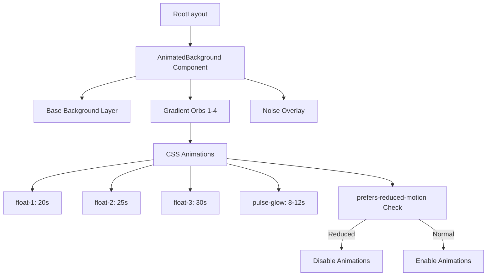

# Plan de Implementación: Fondo Animado con Gradiente CSS

## Resumen
Implementar un fondo animado con gradientes CSS que se mueven suavemente, utilizando los colores del tema actual del portfolio (violeta/índigo) para crear un efecto visual moderno y elegante sin comprometer el rendimiento.

## Objetivos
- Crear un componente reutilizable para el fondo animado
- Utilizar animaciones CSS puras (sin JavaScript para las animaciones)
- Mantener compatibilidad con el tema claro/oscuro existente
- Implementar soporte para `prefers-reduced-motion` (accesibilidad)
- Optimizar para dispositivos móviles

## Arquitectura del Componente

### Archivo: `components/animated-background.tsx`

```typescript
"use client"

export function AnimatedBackground() {
  return (
    <div className="fixed inset-0 -z-10 overflow-hidden">
      {/* Capa de fondo base */}
      <div className="absolute inset-0 bg-background" />
      
      {/* Gradientes animados */}
      <div className="absolute inset-0">
        <div className="gradient-orb-1" />
        <div className="gradient-orb-2" />
        <div className="gradient-orb-3" />
        <div className="gradient-orb-4" />
      </div>
      
      {/* Capa de ruido sutil (opcional) */}
      <div className="absolute inset-0 bg-[url('/noise.svg')] opacity-[0.03]" />
    </div>
  )
}
```

## Animaciones CSS

### Keyframes para movimiento de gradientes

```css
@keyframes float-1 {
  0%, 100% { transform: translate(0, 0) scale(1); }
  25% { transform: translate(5%, -5%) scale(1.1); }
  50% { transform: translate(-5%, 5%) scale(1); }
  75% { transform: translate(-3%, -3%) scale(1.05); }
}

@keyframes float-2 {
  0%, 100% { transform: translate(0, 0) scale(1); }
  33% { transform: translate(-10%, 5%) scale(1.15); }
  66% { transform: translate(10%, -5%) scale(0.95); }
}

@keyframes float-3 {
  0%, 100% { transform: translate(0, 0) rotate(0deg); }
  50% { transform: translate(5%, 5%) rotate(180deg); }
}

@keyframes pulse-glow {
  0%, 100% { opacity: 0.3; }
  50% { opacity: 0.5; }
}
```

### Estilos de los gradientes

```css
.gradient-orb-1 {
  position: absolute;
  width: 600px;
  height: 600px;
  background: radial-gradient(circle, oklch(0.75 0.12 175) 0%, transparent 70%);
  top: -200px;
  left: -200px;
  filter: blur(80px);
  animation: float-1 20s ease-in-out infinite, pulse-glow 8s ease-in-out infinite;
}

.gradient-orb-2 {
  position: absolute;
  width: 500px;
  height: 500px;
  background: radial-gradient(circle, oklch(0.696 0.17 162.48) 0%, transparent 70%);
  top: 50%;
  right: -150px;
  filter: blur(60px);
  animation: float-2 25s ease-in-out infinite, pulse-glow 10s ease-in-out infinite 2s;
}

.gradient-orb-3 {
  position: absolute;
  width: 400px;
  height: 400px;
  background: radial-gradient(circle, oklch(0.769 0.188 70.08) 0%, transparent 70%);
  bottom: -100px;
  left: 30%;
  filter: blur(50px);
  animation: float-3 30s linear infinite, pulse-glow 12s ease-in-out infinite 4s;
}

.gradient-orb-4 {
  position: absolute;
  width: 300px;
  height: 300px;
  background: radial-gradient(circle, oklch(0.627 0.265 303.9) 0%, transparent 70%);
  top: 40%;
  left: 10%;
  filter: blur(40px);
  animation: float-1 18s ease-in-out infinite reverse, pulse-glow 9s ease-in-out infinite 1s;
}
```

## Soporte para Reduced Motion

```css
@media (prefers-reduced-motion: reduce) {
  .gradient-orb-1,
  .gradient-orb-2,
  .gradient-orb-3,
  .gradient-orb-4 {
    animation: none;
    opacity: 0.2;
  }
}
```

## Integración en el Layout

### Modificar `app/layout.tsx`

```tsx
import { AnimatedBackground } from '@/components/animated-background'

export default function RootLayout({
  children,
}: Readonly<{
  children: React.ReactNode
}>) {
  return (
    <html lang="es" className="scroll-smooth">
      <body className={`${geistSans.variable} ${geistMono.variable} font-sans antialiased`}>
        <AnimatedBackground />
        {children}
        <Analytics />
      </body>
    </html>
  )
}
```

## Optimizaciones de Rendimiento

### 1. Hardware Acceleration
```css
.gradient-orb-1,
.gradient-orb-2,
.gradient-orb-3,
.gradient-orb-4 {
  will-change: transform, opacity;
  backface-visibility: hidden;
  perspective: 1000px;
}
```

### 2. Optimización Móvil
```css
@media (max-width: 768px) {
  .gradient-orb-1,
  .gradient-orb-2,
  .gradient-orb-3,
  .gradient-orb-4 {
    width: 300px;
    height: 300px;
    filter: blur(40px);
  }
}
```

### 3. Containment
```css
.animated-background-container {
  contain: layout style paint;
}
```

## Colores del Tema

Los gradientes usarán los colores OKLCH del tema actual:

| Variable | Valor | Uso |
|----------|-------|-----|
| `--primary` | oklch(0.75 0.12 175) | Gradiente principal |
| `--chart-2` | oklch(0.696 0.17 162.48) | Gradiente secundario |
| `--chart-3` | oklch(0.769 0.188 70.08) | Gradiente acento |
| `--chart-4` | oklch(0.627 0.265 303.9) | Gradiente variante |

## Diagrama de Flujo



## Checklist de Implementación

- [ ] Crear archivo `components/animated-background.tsx`
- [ ] Añadir keyframes CSS en `app/globals.css`
- [ ] Implementar estilos de gradientes animados
- [ ] Agregar soporte para `prefers-reduced-motion`
- [ ] Integrar componente en `app/layout.tsx`
- [ ] Probar en desktop
- [ ] Probar en móvil
- [ ] Verificar tema claro/oscuro
- [ ] Optimizar rendimiento (will-change, contain)
- [ ] Ajustar opacidades y velocidades según feedback

## Archivos a Crear/Modificar

| Archivo | Acción | Líneas aprox. |
|---------|--------|---------------|
| `components/animated-background.tsx` | Crear | ~30 líneas |
| `app/globals.css` | Modificar | +~80 líneas |
| `app/layout.tsx` | Modificar | +2 líneas |

## Estimación de Impacto

- **Rendimiento**: Mínimo impacto (CSS puro, GPU acelerado)
- **Tamaño bundle**: +~1 KB (componente)
- **Compatibilidad**: Todos los navegadores modernos
- **Accesibilidad**: Soporte completo para reduced motion
