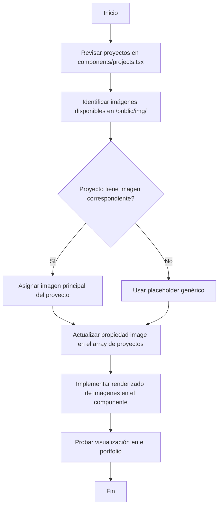

# Plan de Asignación de Imágenes de Marketing a Proyectos

## Resumen Ejecutivo

Este plan detalla cómo asignar las imágenes de marketing disponibles en `/public/img/` a cada proyecto del portfolio definido en `components/projects.tsx`. El plan identifica los proyectos actuales, las imágenes disponibles, y especifica los cambios necesarios para integrar correctamente las imágenes en el componente.

---

## 1. Análisis del Estado Actual

### 1.1 Estructura de Proyectos en `components/projects.tsx`

El componente define dos categorías de proyectos:

#### Proyectos Destacados (`featuredProjects`)
| # | Título | Imagen Actual | Estado de Imagen |
|---|--------|---------------|------------------|
| 1 | Rexus.app - Plataforma SaaS | `/projects/rexus.jpg` | ⚠️ No implementada en renderizado |
| 2 | Vecino Simple - Gestión de Consorcios | `/projects/vecinosimple.jpg` | ⚠️ No implementada en renderizado |
| 3 | Tanques Solares - Ingeniería Industrial | `/projects/tsolares.jpg` | ⚠️ No implementada en renderizado |

**Observación crítica:** Las líneas 133-144 del componente muestran un placeholder con el icono `Folder` en lugar de renderizar la propiedad `image` definida en cada proyecto.

#### Otros Proyectos (`otherProjects`)
| # | Título | Imagen Actual | Estado de Imagen |
|---|--------|---------------|------------------|
| 1 | ArbitrageAR-USDT | No definida | ❌ Sin imagen |
| 2 | IFVG Trading Strategy | No definida | ❌ Sin imagen |
| 3 | Trading IA | No definida | ❌ Sin imagen |
| 4 | Máquina Cosechadora | No definida | ❌ Sin imagen |
| 5 | Tanque de Gas Industrial | No definida | ❌ Sin imagen |
| 6 | Dashboard Power BI | No definida | ❌ Sin imagen |

---

## 2. Inventario de Imágenes Disponibles

### 2.1 Carpeta `/public/img/Rexxus/`
| Archivo | Descripción | Uso Sugerido |
|---------|-------------|--------------|
| `rexus.svg` | Placeholder temporal | No usar en producción |
| `rexus1-dashboard.jpg` | Dashboard principal | ✅ Imagen principal para Rexus.app |
| `rexus2-usuarios.jpg` | Sistema de gestión de usuarios | Imagen secundaria |
| `rexus3-reportes.jpg` | Sistema de reportes | Imagen secundaria |
| `rexus4-api.jpg` | Documentación de API | Imagen secundaria |

### 2.2 Carpeta `/public/img/vecinosimple/`
| Archivo | Descripción | Uso Sugerido |
|---------|-------------|--------------|
| `vecinosimple.svg` | Placeholder temporal | No usar en producción |
| `vecino1-consorcios.jpg` | Gestión de consorcios | ✅ Imagen principal para Vecino Simple |
| `vecino2-expensas.jpg` | Sistema de expensas | Imagen secundaria |
| `vecino3-reclamos.jpg` | Sistema de reclamos | Imagen secundaria |
| `vecino4-comunicacion.jpg` | Comunicación entre vecinos | Imagen secundaria |

### 2.3 Carpeta `/public/img/tsolares/`
| Archivo | Descripción | Uso Sugerido |
|---------|-------------|--------------|
| `tsolares.svg` | Placeholder temporal | No usar en producción |
| `ts1-fabricacion.jpg` | Proceso de fabricación | ✅ Imagen principal para Tanques Solares |
| `ts2-detalleproducto.jpg` | Detalles técnicos | Imagen secundaria |
| `ts3-productohogar.jpg` | Tanque instalado en hogar | Imagen secundaria |
| `ts4-procesofab.jpg` | Diagrama de proceso | Imagen secundaria |

### 2.4 Carpeta `/public/img/harvesting/`
| Archivo | Descripción | Uso Sugerido |
|---------|-------------|--------------|
| `harvest1-diseno.jpg` | Diseño de máquina | ✅ Imagen principal para Máquina Cosechadora |
| `harvest2-prototipo.jpg` | Prototipo | Imagen secundaria |
| `harvest3-pruebas.jpg` | Pruebas | Imagen secundaria |
| `harvest4-componentes.jpg` | Componentes | Imagen secundaria |

---

## 3. Plan de Asignación de Imágenes

### 3.1 Proyectos Destacados

#### Proyecto 1: Rexus.app - Plataforma SaaS
| Propiedad | Valor Actual | Valor Propuesto |
|-----------|--------------|-----------------|
| `image` | `/projects/rexus.jpg` | `/img/Rexxus/rexus1-dashboard.jpg` |

**Justificación:** La imagen `rexus1-dashboard.jpg` muestra el dashboard principal de la plataforma, lo cual es más representativo del producto SaaS que se describe en la descripción del proyecto.

#### Proyecto 2: Vecino Simple - Gestión de Consorcios
| Propiedad | Valor Actual | Valor Propuesto |
|-----------|--------------|-----------------|
| `image` | `/projects/vecinosimple.jpg` | `/img/vecinosimple/vecino1-consorcios.jpg` |

**Justificación:** La imagen `vecino1-consorcios.jpg` muestra la gestión de consorcios, que es la funcionalidad principal descrita en el proyecto.

#### Proyecto 3: Tanques Solares - Ingeniería Industrial
| Propiedad | Valor Actual | Valor Propuesto |
|-----------|--------------|-----------------|
| `image` | `/projects/tsolares.jpg` | `/img/tsolares/ts1-fabricacion.jpg` |

**Justificación:** La imagen `ts1-fabricacion.jpg` muestra el proceso de fabricación del tanque, lo cual representa bien el trabajo de ingeniería industrial descrito.

### 3.2 Otros Proyectos

#### Proyecto 4: Máquina Cosechadora
| Propiedad | Valor Actual | Valor Propuesto |
|-----------|--------------|-----------------|
| `image` | No definida | `/img/harvesting/harvest1-diseno.jpg` |

**Justificación:** Este proyecto corresponde directamente a la carpeta `harvesting/` que contiene imágenes de la máquina cosechadora.

#### Proyectos sin imágenes disponibles
Los siguientes proyectos no tienen imágenes correspondientes en `/public/img/`:

| Proyecto | Estado | Recomendación |
|----------|--------|---------------|
| ArbitrageAR-USDT | Sin imagen | Usar placeholder genérico o crear imagen |
| IFVG Trading Strategy | Sin imagen | Usar placeholder genérico o crear imagen |
| Trading IA | Sin imagen | Usar placeholder genérico o crear imagen |
| Tanque de Gas Industrial | Sin imagen | Usar placeholder genérico o crear imagen |
| Dashboard Power BI | Sin imagen | Usar placeholder genérico o crear imagen |

**Recomendación:** Para estos proyectos, se puede usar el placeholder existente (`/public/placeholder.jpg` o `/public/placeholder.svg`) hasta que se creen imágenes específicas.

---

## 4. Cambios Necesarios en el Código

### 4.1 Modificaciones en `components/projects.tsx`

#### Paso 1: Actualizar las rutas de imágenes en `featuredProjects`

```typescript
const featuredProjects = [
  {
    title: "Rexus.app - Plataforma SaaS",
    description: "...",
    image: "/img/Rexxus/rexus1-dashboard.jpg",  // CAMBIO: de /projects/rexus.jpg
    tech: ["Python", "FastAPI", "React", "PostgreSQL", "Docker"],
    github: "https://github.com/nomdedev/Rexus.app",
    external: "https://rexus.app",
  },
  {
    title: "Vecino Simple - Gestión de Consorcios",
    description: "...",
    image: "/img/vecinosimple/vecino1-consorcios.jpg",  // CAMBIO: de /projects/vecinosimple.jpg
    tech: ["Next.js", "Supabase", "TypeScript", "Tailwind CSS"],
    github: "https://github.com/nomdedev",
    external: "#",
  },
  {
    title: "Tanques Solares - Ingeniería Industrial",
    description: "...",
    image: "/img/tsolares/ts1-fabricacion.jpg",  // CAMBIO: de /projects/tsolares.jpg
    tech: ["CAD 3D", "SolidWorks", "Ingeniería Mecánica", "Normas ISO"],
    github: "#",
    external: "https://drive.google.com",
  },
]
```

#### Paso 2: Agregar propiedad `image` a `otherProjects` (para Máquina Cosechadora)

```typescript
const otherProjects = [
  // ... otros proyectos ...
  {
    title: "Máquina Cosechadora",
    description: "...",
    image: "/img/harvesting/harvest1-diseno.jpg",  // AGREGAR
    tech: ["CAD", "Ingeniería Mecánica", "Normas ISO"],
    github: "#",
    external: "https://drive.google.com",
  },
  // ... otros proyectos ...
]
```

#### Paso 3: Implementar renderizado de imágenes en Proyectos Destacados

**Código actual (líneas 133-144):**
```tsx
<div className="md:col-span-7 relative aspect-video rounded-lg overflow-hidden bg-secondary group">
  <div className="absolute inset-0 bg-primary/20 group-hover:bg-transparent transition-colors duration-300" />
  <div className="w-full h-full bg-gradient-to-br from-primary/20 to-secondary flex items-center justify-center">
    <Folder className="w-16 h-16 text-primary/40" />
  </div>
</div>
```

**Código propuesto:**
```tsx
<div className="md:col-span-7 relative aspect-video rounded-lg overflow-hidden bg-secondary group">
  <div className="absolute inset-0 bg-primary/20 group-hover:bg-transparent transition-colors duration-300" />
  
</div>
```

#### Paso 4: Agregar imágenes a Otros Proyectos (opcional)

Si se desea agregar imágenes a las tarjetas de "Otros Proyectos", se puede agregar un elemento `` antes del título en cada tarjeta (líneas 218-244):

```tsx
<div className="group bg-card p-6 rounded-lg hover:-translate-y-2 transition-all duration-300">
  {project.image && (
    <div className="aspect-video mb-4 rounded-lg overflow-hidden bg-secondary">
      
    </div>
  )}
  <div className="flex items-center justify-between mb-6">
    {/* ... resto del contenido ... */}
  </div>
</div>
```

---

## 5. Diagrama de Flujo



---

## 6. Resumen de Tareas

| # | Tarea | Prioridad | Archivo(s) Afectado(s) |
|---|-------|-----------|------------------------|
| 1 | Actualizar ruta de imagen de Rexus.app | Alta | `components/projects.tsx` |
| 2 | Actualizar ruta de imagen de Vecino Simple | Alta | `components/projects.tsx` |
| 3 | Actualizar ruta de imagen de Tanques Solares | Alta | `components/projects.tsx` |
| 4 | Agregar propiedad image a Máquina Cosechadora | Media | `components/projects.tsx` |
| 5 | Implementar renderizado de imágenes en featuredProjects | Alta | `components/projects.tsx` |
| 6 | (Opcional) Agregar imágenes a otros proyectos | Baja | `components/projects.tsx` |
| 7 | Probar visualización en el portfolio | Alta | N/A |

---

## 7. Consideraciones Adicionales

### 7.1 Optimización de Imágenes
- Las imágenes deben estar optimizadas para web (máximo 500KB por imagen)
- Formatos recomendados: JPG para fotografías, PNG para gráficos con transparencia
- Dimensiones recomendadas: 1200x800px para imágenes principales

### 7.2 Accesibilidad
- Siempre incluir el atributo `alt` en las etiquetas ``
- Usar el título del proyecto como texto alternativo

### 7.3 Responsive Design
- Las imágenes deben usar `object-cover` para mantener la proporción
- El contenedor tiene `aspect-video` (16:9) para consistencia visual

### 7.4 Placeholder para Proyectos Sin Imagen
Los siguientes proyectos pueden usar placeholders existentes:
- `/public/placeholder.jpg` - Imagen genérica
- `/public/placeholder.svg` - SVG genérico

---

## 8. Tabla de Referencia Rápida

| Proyecto | Ruta de Imagen Propuesta | Disponible |
|----------|--------------------------|------------|
| Rexus.app | `/img/Rexxus/rexus1-dashboard.jpg` | ✅ |
| Vecino Simple | `/img/vecinosimple/vecino1-consorcios.jpg` | ✅ |
| Tanques Solares | `/img/tsolares/ts1-fabricacion.jpg` | ✅ |
| Máquina Cosechadora | `/img/harvesting/harvest1-diseno.jpg` | ✅ |
| ArbitrageAR-USDT | `/public/placeholder.jpg` | ✅ |
| IFVG Trading Strategy | `/public/placeholder.jpg` | ✅ |
| Trading IA | `/public/placeholder.jpg` | ✅ |
| Tanque de Gas Industrial | `/public/placeholder.jpg` | ✅ |
| Dashboard Power BI | `/public/placeholder.jpg` | ✅ |

---

## 9. Validación

Antes de implementar, verificar:
- [ ] Las imágenes existen en las rutas especificadas
- [ ] Las imágenes tienen dimensiones apropiadas
- [ ] Las imágenes no exceden el tamaño recomendado (500KB)
- [ ] Los nombres de archivos son consistentes con el plan

---

**Fecha de creación:** 2026-01-26
**Estado:** Plan completo, listo para implementación
**Modo recomendado para implementación:** Code mode
